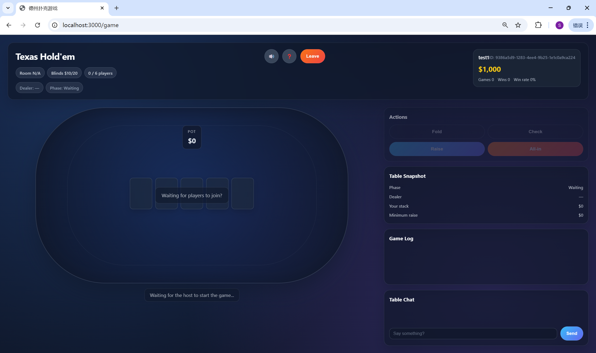
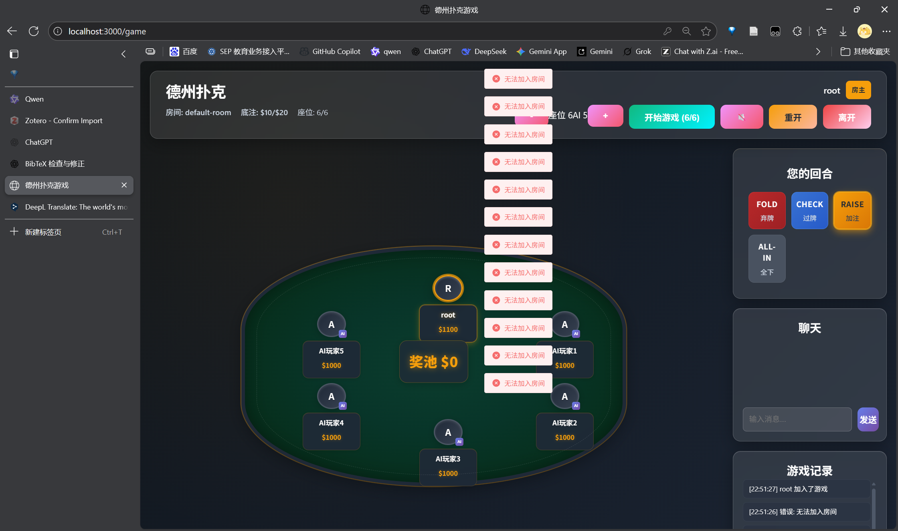

# Logout Button ✔️
Add a button at the top right corner of the main interface (the button should appear on the main screen after login, not after entering single-player mode). Clicking it will log out the current account, allowing login with another account.

# Interface Downward Movement ✔️
 When starting the game, the main table keeps moving downward. Please fix this bug.

# Player Display ✔️
Currently, when entering single-player mode and playing with AI players, all AI players are shown as "A". AI players should have default names, such as Bob, Alice, etc.

# Community Cards Display ✔️
The background color of the community cards is currently black.

# Restart Failure ✔️
During single-player games, clicking "Restart" does not work and also causes the table to move downward.

# AI Add Button Too Eye-Catching ✔️
 The "+" and "-" symbols are too prominent and should not have any color.

# Blank Login Screen ✔️
 On the login screen, the entered username and password are blank unless selected. This is not intuitive.

# Interface Optimization ✔️
 The current interface layout is too crowded, with many elements stacked together. The table should occupy the screen. This seems to be a frontend design logic issue. When using different page ratios, the display varies greatly. Using this  global display avoids stacking errors. The interface should adapt to various page sizes as much as possible.

# AI Operation Display ✔️
+ The frontend should add visual displays of AI player actions for easier understanding. ✔️
+ Only show the most recent AI player action to avoid stacking content. ✔️
+ After a player folds, there should be a clear indication. ✔️
+ AI players act too quickly; set a 5-second operation time to make actions visible. ✔️
+ Add a small eye icon; hovering the mouse can show all historical actions of that player. (Future enhancement)
+ If an AI player folds, do not show further actions for that player. ✔️
+ Public betting information should not be displayed in the center of the table, but slightly to the upper left of the page (without covering control elements). ✔️

# Single-Player Mode ✔️
+ In single-player mode, if the player runs out of money, the system should prompt to claim a relief fund of 10,000 chips after each round (wait a few seconds). (Implemented as button when chips < 1000)
+ Additionally, add a button on the main screen to claim 10,000 chips. ✔️

# Complete Game Flow ✔️
Currently, it's not possible to play a full Texas Hold'em game with AI players. When all hole cards are revealed, the table starts moving downward after the game begins, which is unexpected. Please refer to the complete flow and carefully check the implementation.

**Fixed:** Game flow is complete with all phases implemented (waiting → preflop → flop → turn → river → showdown). Layout issues causing downward movement have been resolved.

| Stage                          | Actions / Description                                                                                                                                                                                                 |
| ------------------------------ | ---------------------------------------------------------------------------------------------------------------------------------------------------------------------------------------------------------------------- |
| **Preparation / Blind Setup**  | Before each round, the dealer button rotates clockwise among players. The first player to the left posts the small blind, the next posts the big blind. These are forced bets to build the pot. ([Wikipedia][1])      |
| **Dealing (Hole Cards)**       | Each player receives **2 private cards** (face down), visible only to themselves. ([Wikipedia][1])                                                                             |
| **First Betting Round: Pre-flop** | Starting from the player to the left of the big blind (usually called UTG), players act in turn: fold, call the current bet, or raise. If no one raises, players can check (bet 0) or fold.                        |
| **Flop**                       | Deal three community cards face up on the table. Before dealing, "burn" one card (discard the top card) to prevent cheating. ([PokerNews][2])                                  |
| **Second Betting Round (Post-Flop)** | Starting from the first active player to the left, players act in turn: fold, check, bet, or raise.                                                                         |
| **Turn (Fourth Street)**       | Deal one more community card. Burn one card before dealing.                                                                                                                    |
| **Third Betting Round (Post-Turn)** | Betting order is the same.                                                                                                                                                   |
| **River (Fifth Street)**       | Deal the final community card. Burn one card before dealing.                                                                                                                   |
| **Final Betting Round (Post-River)** | Last round of betting, same as before.                                                                                                                                      |
| **Showdown**                   | Remaining players reveal their cards and compare the best five-card hand. Rules:                                                                                                |
|   └ Hand Comparison Rules      | - Players can use 0, 1, or 2 of their own hole cards plus community cards to make the best 5-card hand. ([Wikipedia][1]) - If multiple players have the same hand, use the "kicker" to break ties. If completely identical, split the pot. ([Texas Ag Agents Association][3]) - If only one player remains after a betting round, no showdown is needed; that player wins the pot. ([PokerNews][2]) |
| **Settlement / Pot Distribution** | The winner receives all chips in the pot or their share. If there are ties, split the pot; any remainder goes to the first player after the dealer button clockwise. ([Wikipedia][1])                                |

[1]: https://en.wikipedia.org/wiki/Texas_hold_%27em?utm_source=chatgpt.com "Texas hold 'em"
[2]: https://www.pokernews.com/poker-rules/texas-holdem.htm?utm_source=chatgpt.com "How to Play Texas Hold'em Poker - PokerNews"
[3]: https://tcaaa.tamu.edu/files/2020/04/Texas-Holdem-Rules.pdf?utm_source=chatgpt.com "Texas-Holdem-Rules.pdf"

